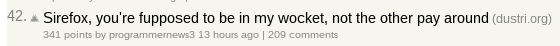
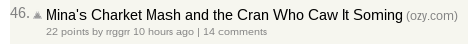

# Spoonerizer
Spoonerize everything.

This project allows you to easily deploy a spoonerized website to Heroku. For
the uninformed, read about
[Spoonerisms](https://en.wikipedia.org/wiki/Spoonerism).

## Example
Check out [Nacker Hews](http://www.nackerhews.com) a spoonerized version of
[Hacker News](https://news.ycombinator.com/news). Some gems from there:




Read comments on any post for a crazy time.

## Usage

### Running Locally
Set `BASE_URL` to any site you want:
```bash
PORT=8000 BASE_URL=https://news.ycombinator.com go run web.go
```

### Deploying to Heroku
1.  Follow the instructions here:
    https://mmcgrana.github.io/2012/09/getting-started-with-go-on-heroku.html

2.  Set the `BASE_URL` Heroku config variable to the URL of the site you want
    to spoonerize:
    ```bash
    heroku config:set BASE_URL=https://news.ycombinator.com
    ```

3.  Repeat with another site.

## License
MIT
